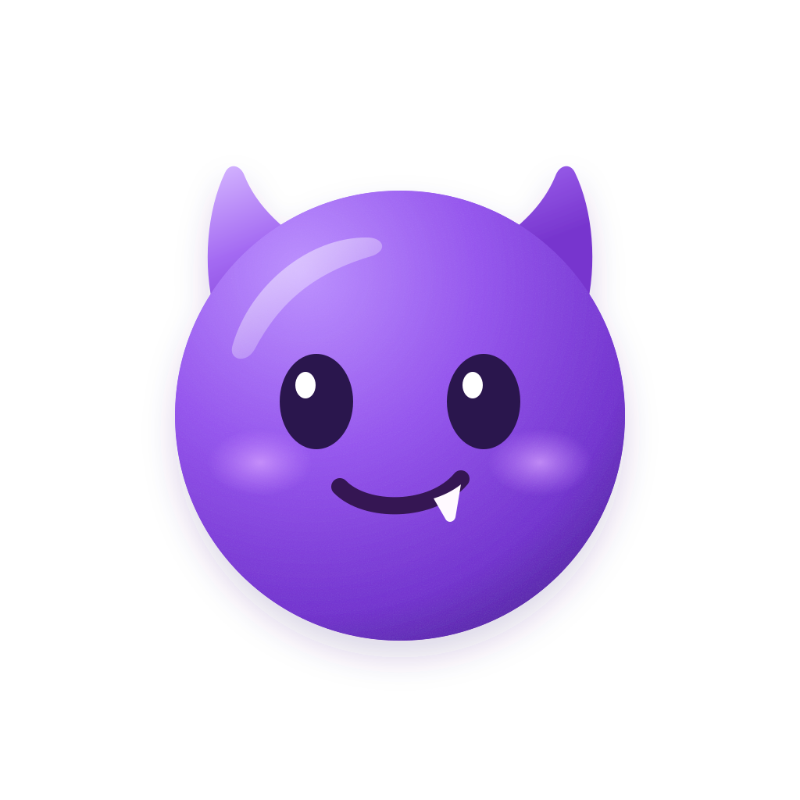

<a id="readme-top"></a>

[中文](#中文) | [English](#english)

<div align="center">

  

  <h1>DesiCast</h1>

  <p>
    <strong>公共及团队 SVG 图库，为人和 AI Agent 提供统一的图标使用入口</strong>
    <br />
    <em>Public & team SVG icon library for humans and AI agents.</em>
  </p>

  <p>
    <a href="https://github.com/Niall-Young/Iconcast"></a>
    
    =24" />
    
    
    
  </p>

  <p>
    
    
    
    
    
  </p>

  <p>
    <b><a href="#-简体中文">简体中文</a></b>
    &nbsp; • &nbsp;
    <b><a href="#-english">English</a></b>
  </p>

</div>

---

<a id="-简体中文"></a>
<a id="中文"></a>
<a id="zh-cn"></a>

## 中文

通用设置的「菜单栏中显示」默认关闭，开启后立即显示菜单栏图标，关闭窗口后继续运行，可从菜单栏打开 DesiCast 或退出应用；关闭开关立即移除图标，设置在重启后保留

> 🌐 **语言切换 / Language**: [English Version](#-english) &nbsp;|&nbsp; [回到顶部 / Back to Top](#readme-top)

### 项目简介

DesiCast 是 macOS Electron 应用，使用 [Gendesign Design System](https://github.com/Niall-Young/Gendesign-Design-system) 的真实组件、Base UI 和 Nico 主题。桌面应用和独立 stdio MCP 共用图库、缓存、搜索与导出核心。

品牌标识为浅色玻璃底板上的紫色小恶魔。`assets/Desicast.icon` 保存 Icon Composer 分层源文件，主体与五官使用独立 SVG 图层；`assets/icon.svg` 保留矢量预览。运行 `npm run icon:generate` 使用 Xcode 内置的 Icon Composer 渲染工具生成 PNG 和 ICNS，并在 1024px 画布中添加每边 96px 的透明留边。该命令需要安装包含 Icon Composer 的 Xcode；可通过 `ICON_COMPOSER_TOOL` 指定 `ictool` 路径。Electron 当前使用静态玻璃渲染，不随系统光照动态变化。桌面名称为 DesiCast，包名和 MCP 注册名为 `desicast`。默认数据目录、SQLite 文件名与 Keychain 服务名也已更名；不会自动迁移旧 Iconcast 数据或凭据，已有 MCP 客户端需重新注册。

### 核心能力

- **公共图库检索**：浏览及搜索 Iconify 公共图库，按需获取 SVG，展示来源及许可证。
- **团队私有同步**：连接公开或私有 GitHub、GitLab、自托管 GitLab HTTPS 仓库，按需选择分支和 SVG 目录。
- **原子增量快照**：原子同步团队图标并保留提交 SHA；同步失败时自动继续使用上一份安全缓存。
- **双模搜索**：中英文关键词搜索；可使用用户配置的多模态模型进行参考图片的相似形状搜索。
- **多技术导出**：一键复制 SVG（可直接嵌入 HTML）、React TSX、Vue SFC 代码，导出 SwiftUI SVG image set 及配套调用代码。桌面提供 SVG、React、Vue、SwiftUI 四种格式；MCP 仍支持 `html` 目标。
- **独立 MCP 服务**：随安装包内置运行入口，无需常驻 Electron 桌面，且无需终端用户配置独立 Node 环境。

默认快捷入口包括 Lucide、Tabler Icons、Unicons、MingCute、Google Material Icons 和 Eva Icons。侧栏显示公共目录的实际图标总数（不是下载缓存数量），团队库显示成功索引的 SVG 数量。公共目录每天缓存、每小时自动检查，并可使用「刷新图库」立即检查，刷新期间按钮显示 loading 并阻止重复点击，成功后显示 message 提示；团队库同步后记录新增、SVG 更新和删除。公共库徽标提示目录数量、可用版本及 API 最后修改时间变化；旧缓存会按需更新，网络失败时仍保留旧 SVG；徽标跨重启保留；进入有更新的图库时，距窗口底部 80px 显示更新消息，点击「我知道了」关闭并标记已读，20 秒后自动关闭但保留未读徽标。默认库支持无关键词分页浏览。侧栏「图库选项」提供仓库类型、状态与排序；类型和状态默认不勾选并支持多选，组内取并集、组间取交集。排序为单选，默认「首字母正序」，选择其他项会替换当前排序。旧仓库缺少添加时间时使用既有顺序，新增仓库记录添加时间。

首页每页最多显示 8 个图标库（4 列 × 2 行），超过 8 个时在下方居中显示上一页、下一页图标按钮和页码。下一页向左滑动，上一页向右滑动；系统开启减少动态效果时取消滑动过渡。

右键侧栏或首页中的任意图标库，可打开、置顶/取消置顶或查看来源；默认公共图标库不提供配置和移除操作。置顶状态保存在本机，侧栏在图标库上方单独显示置顶分组，分组标题不带操作按钮；没有符合当前筛选的置顶项时不显示。置顶行悬停或键盘聚焦时显示填充 pin 按钮，点击取消置顶并回到普通图标库列表。团队图库另提供配置和移除：配置在当前页面打开与添加图标库相同的弹窗，预填现有仓库信息；移除须确认，仅删除本地索引和凭证，不修改远端仓库。此前已隐藏的公共图库仍可重新添加。

首页、侧栏、图标网格和详情面板按用户的 Figma 设计还原，图库标识与控件 SVG 随应用打包；设计节点、尺寸与校验值见 [设计素材来源记录](src/renderer/design-assets/provenance.json)，原始品牌来源见 [来源记录](src/renderer/library-marks/provenance.json)。Lucide 保留官方深色版本，其余品牌保留设计原色。Unicons 使用用户提供图片的矢量重建版本，并非官方原始 SVG。品牌归各自所有者，图标许可不代表品牌使用授权。

图库筛选与排序使用 Base UI Checkbox、RadioGroup/Radio 原语组合，选中项在文字右侧显示无边框 MingCute 对勾；SVG 目录使用基于上游 TreeSelect/Tree 的多选控件，选项显示 Checkbox，所选值用逗号分隔，不再重复显示下方标签。普通选择使用支持单选和多选的 Base UI Select；TreeSelect 与 Select 共用输入框、弹层和选项样式，外观与 Nico Input 一致并在右侧显示下拉箭头；禁止使用 NativeSelect。组件源码及资源校验值见 [Gendesign 来源清单](gendesign-provenance.json)，`npm test` 校验导入源码及明确记录的应用层适配。该版本没有独立 Segmented/Menu，上游 Tabs 没有滑块动画；应用层网格/列表、导出格式、MCP 设置和仓库类型 Segmented 使用 260ms 背景滑动，系统开启减少动态效果时取消过渡；网格/列表内容切换复用代码预览的 200ms 左右滑入动画，切至列表从右侧滑入，切回网格从左侧滑入；动作弹层和右键菜单的组合边界见 [GENDESIGN.md](GENDESIGN.md)。

### 快速开始

开发需要 macOS、Node 24+、npm、Git，以及用于 HTTPS Git 集成测试的 OpenSSL。桌面自动化需要可用的 macOS 图形会话。

```sh
npm ci
npm run dev
```

开发服务默认使用 5173 端口；端口被占用时自动选择可用端口，并将实际地址传给 Electron 与热更新连接。

开发模式下修改主进程或共享核心后需重启；界面通过 Vite 热更新。

macOS 上 `npm run dev` 会在 `~/Library/Caches/DesiCast/dev/` 准备经过临时签名的 `DesiCast Dev.app`（独立标识 `com.niallyoung.desicast.dev`），通过 LaunchServices 启动，避免菜单栏图标继承终端或 Orca 的应用归属。该开发运行时不安装到 Applications，也不生成发布包；Vite 热更新和现有数据目录保持不变。首次启动需要复制 Electron 运行时，后续启动复用缓存；主进程日志位于 `.work/dev/main.stdout.log` 与 `.work/dev/main.stderr.log`。若系统禁止显示，可在系统设置的「菜单栏」中为 DesiCast Dev 单独开启权限。

使用 `VITE_UPDATE_MESSAGE_PREVIEW=1 npm run dev` 可预览「更新了 199 个图标」的假数据通知，底部按钮可重复触发；此预览不会标记真实图库已读，生产构建不显示预览入口。

### 使用方法

图标区域的搜索、刷新、同步和分页加载使用居中的 raised 浮层与三个点依次放大的动画，保留图标网格原有的变浅效果；加载状态至少显示 2 秒，较慢请求持续显示到完成，系统减少动态效果时停用动画。

外观设置提供系统、浅色和深色模式；主题色默认灰色，可切换 Nico 的红、橙、黄、青柠、绿、青绿、天蓝、蓝、紫、粉色。彩色在浅色模式使用 500、悬停使用 600，深色模式使用 400、悬停使用 300；灰色保留原有中性色映射。全局缩放支持 100%（默认）、110%、125%、150%、200%，作用于整个界面。主题色下拉选项和当前选中值显示颜色圆点预览，侧边菜单与图标卡片选中状态使用中性色，按钮等品牌控件随主题色变化。设置立即保存并在重启后保留；开发模式下更新外观保存逻辑后需重启主进程，若保存结果不匹配会提示重新启动。

侧栏「全部图标」直接展示跨图库的图标网格，支持关键词搜索、网格/列表切换和分页；入口使用 MingCute classify 图标。顶部图库按钮默认无背景，图标与文字对齐下方内容，悬停背景向外延伸，点击展开菜单，可切换全部图标与保留的公共或团队图库，并与侧栏导航同步。全局搜索通过 ⌘K 打开弹窗，不再使用独立搜索页面；仅检索保留的默认公共图库和已添加的团队图库，已移除的图库不参与检索。输入框固定在窗口上方，加载、空结果和结果数量变化不会改变其位置；长列表在弹窗内滚动。弹窗宽度为 640px，顶部为 48px 搜索栏，结果行高为 40px。未输入时可直接打开图库，输入关键词并按回车后，按图标库和图标分组显示匹配结果；底部「全部 / 图标库 / 图标」可筛选结果类型，「查看全部」展开更多已加载的图标。全局搜索仅支持关键词输入和文字粘贴，不提供图片上传或图片粘贴搜索。支持 ↑↓ 选择、搜索完成后 Enter 打开及 Esc 或「退出」关闭。图标集下拉也仅显示保留的默认图库，“全部图标集”打开全局搜索弹窗。

关键词输入或清空时不触发检索，按回车后搜索并恢复文本搜索。图标页面支持网格/列表切换，两种视图都在图标名称下方显示所属库名，点击图标打开独立详情面板，顶部代码按钮可收起详情。搜索框右侧提供独立的以图搜图与刷新按钮，图片搜索入口使用 MingCute `attachment_3_regular`；参考图片以包含缩略图和移除按钮的紧凑标签显示在搜索框内；仅聚焦搜索框时可粘贴图片，上传或粘贴后直接搜索整张图片，删除标签后恢复关键词搜索，网格/列表切换按设计使用 32px 分段控件；详情可复制名称、通过 32px 等宽 Segmented 切换导出格式和导出文件，单色图标默认跟随使用处的颜色，尺寸在项目中调整；来源与许可保留在复制的代码和导出的资源中。

1. **查找图标**：在首页或侧栏选择图库，或使用「全部图标」浏览所有图库的图标。点击「添加图标库」打开 640 × 615px 固定高度弹窗连接团队仓库，名称最多 20 个字符；超限仍可输入，超出部分标红并在字段下方提示错误，恢复到限制内才可保存；侧栏底部设置按钮进入带分类导航的独立设置页面，包含通用信息、外观、MCP 连接器、模型配置与图标库管理。侧栏「返回」回到进入设置前的页面；外观模式切换后立即保存；模型及仓库使用各自的保存操作。MCP 标签仍可直接打开连接设置。名称下方先选择公开或私有仓库：公开仓库仅需链接与 SVG 目录；私有仓库在链接下方显示用户名和访问令牌，未配置本机凭据时需填写令牌。离开链接输入框后自动解析仓库信息，链接右侧的「解析仓库」按钮显示加载状态；解析完成或失败后可手动重新解析，默认使用仓库默认分支，其他分支可通过直接显示的分支选择器切换；通过多选树形目录选择器选择 SVG 目录或整个仓库。
2. **凭据配置**：用户名是 HTTPS Git 认证账号，仅在仓库要求指定账号时填写；可按需填写访问令牌连接私有仓库，令牌默认隐藏并在添加后保存至 Keychain；先填链接再补令牌时，离开令牌输入框会重新读取仓库信息，也可手动重试。留空时自动复用本机 Git 凭据或已登录的 `gh` / `glab`。仓库类型随配置保存；编辑私有仓库时令牌留空保留并复用已有凭据，切换为公开并保存会清除已保存的令牌。视觉检索由弹窗底部开关控制，新增图库默认开启，编辑时保留已保存的选择；关闭后隐藏该库的以图搜图按钮，同时禁止拖入或粘贴图片搜索，全局视觉搜索与 MCP 视觉搜索也会跳过该库。
3. **图库同步**：添加仓库后立即同步，应用启动时检查更新，也可手动同步。移除图库只删除本地索引和凭据。
4. **复制代码与导出**：选择图标和目标技术，复制代码或导出文件。导出会创建新的子目录，不静默覆盖现有资源。
5. **多端集成**：React 输出要求 React 18+；Vue 输出要求 Vue 3.5+。SwiftUI 将导出的 `.imageset` 拖入 `Assets.xcassets`，再使用返回的 `Image` 代码。
6. **视觉搜索与快捷键**：<kbd>⌘</kbd> + <kbd>K</kbd> 打开全局搜索弹窗。图片支持上传、拖入或在聚焦图标库搜索框后粘贴，直接搜索整张图片，无需裁剪；搜索框外粘贴不会触发图片搜索。

### 配置说明

全局关键词和视觉搜索共用固定范围：Lucide、Tabler Icons、Unicons、MingCute、Material Icons、Eva Icons 六个默认库及用户已添加的图库；已移除的图库和其他 Iconify 库（包括旧缓存）不参与检索。视觉搜索还要求图库开启视觉检索，关闭视觉检索不影响关键词搜索。桌面和 MCP 使用同一检索规则。

视觉模型使用兼容 OpenAI Chat Completions 的图片输入接口。在模型配置中点击「添加供应商」，通过 640px 弹窗填写 API 基础地址（通常以 `/v1` 结尾）、模型名称和可选 API Key。可用「测试连接」发送图片请求检查当前草稿，测试不会保存设置；点击「确定」后保存并启用该模型。已添加的供应商以单选列表展示，切换后立即保存并用于桌面和 MCP 视觉搜索，不设独立的视觉能力开关。点击每行右侧删除按钮后，需在确认弹窗中确认才会删除供应商并清除其 Keychain 凭据；删除当前供应商后启用剩余列表中的第一个，删完后恢复空状态。API Key 按供应商分别保存在 Keychain，旧版单模型配置和 Key 会保留。支持 HTTPS 或本机 HTTP 服务。

连接官方 DeepSeek API 时，图片识别与排序会关闭默认思考模式，为 JSON 结果保留输出预算；输出被截断时会明确提示长度上限。

视觉检索同时召回单关键词与主题/形状组合词（例如 `ad circle`），最多并行 3 组检索，交错选取最多 48 个候选供视觉排序。排序支持候选编号与完整图标 ID；公共预览优先按图标集批量获取，减少逐个 SVG 请求，公共图库检索提示区分部分失败与全部失败，部分失败提示结果可能不完整，全部失败才说明使用本地缓存候选。

参考图和允许的候选图标预览会发送到该服务；团队仓库默认禁止模型图片搜索，可按仓库单独开启。图片限 PNG、JPEG、WebP 格式（最大 8 MB），模型处理上限 1600 万像素。搜索基于关键词召回和视觉排序，不保证找到原图标。

默认数据目录为 `~/Library/Application Support/DesiCast`。SQLite 启用 WAL 模式；已缓存图标可完全离线使用。凭据严格安全保存在 macOS Keychain 中。Git 使用临时、限定仓库主机的凭据助手，严禁将令牌写入 URL 或普通配置文件。

- `DESICAST_DATA_DIR`：指定独立数据目录；独立 MCP 同样支持 `--data-dir`。
- `DESICAST_TEST_MODE=1`：仅在未打包桌面开发环境使用内存凭据，并关闭启动时仓库同步，供测试隔离使用。

### 项目结构

```text
├── src/
│   ├── core/       # 图标来源、SQLite、Git 同步、SVG 验证、搜索、模型与输出适配核心
│   ├── electron/   # 桌面生命周期、受限 IPC 通信、剪贴板与文件导出实现
│   ├── mcp/        # 独立 stdio MCP 服务入口
│   └── renderer/   # 应用界面、页面状态与 Gendesign 组件消费
├── components/ui/  # Gendesign 基础设计系统组件
├── tests/          # 核心、真实 HTTPS Git 协议和 Electron 交互与导出渲染测试
└── assets/         # 原生应用图标及图形资源
```

上游组件版本及来源见 [GENDESIGN.md](GENDESIGN.md)。项目详细指引见 [AGENTS.md](AGENTS.md)。

### 开发与验证

```sh
npm run typecheck    # 静态类型检查
npm test             # 核心逻辑与集成测试
npm run build        # 构建共享核心、主进程与渲染器
npm run test:ui      # Playwright 桌面 UI 自动化测试，仅在明确要求时运行
npm run package      # 生成 macOS DMG / ZIP 安装包
```

日常由用户自行验证桌面交互和视觉效果。AI 不自动运行 `test:ui` 或打开应用做验证；这套 Playwright 测试会启动真实 Electron 窗口并模拟交互，只有用户明确要求时才运行，且需先执行 `npm run build`。打包和本地安装也需用户明确要求。打包与桌面自动化测试需按顺序运行。安装包输出到 `release/`，包含当前机器架构的 `.app`、ZIP 和 DMG；当前已通过 Apple Silicon 构建验证。安装包未做 Developer ID 签名或公证，供本地与团队内部使用；不自动对外发布。

已验证矩阵：真实 Iconify 搜索、公开 Lucide 仓库同步、私有 GitHub 仓库同步、Keychain 读写、HTTPS 凭据与增改删同步、Electron 明暗主题及复制流程、HTML／React／Vue 实际渲染、独立 MCP 协议和 Codex 实际检索／Vue 获取。

视觉模型回归测试使用受控服务响应，另已通过用户配置的官方 DeepSeek Flash 与真实 Iconify 检索验证参考图片的描述和排序，不代表所有模型或图片都能匹配；本机无完整 Xcode，SwiftUI 目前验证资源结构，未完成 Xcode 编译。GitLab 使用同一 HTTPS Git 路径，尚未验证真实 GitLab 账户。

桌面目录控件检查通过 Electron IPC 使用仓库元数据夹具；核心集成测试连接本地仓库验证 HTTPS Git。这些 UI 检查不代表当前公共 GitHub 可用性。

### MCP 服务与 CLI

点击侧栏底部 MCP 标签打开「MCP 配置」弹窗，在 ChatGPT（Codex）、Claude code 和其他页签中切换并复制适用于当前安装位置的 Codex、Claude Code 注册命令或其他客户端的通用 JSON。Claude Code 命令使用 `--transport stdio --scope user`，让当前用户的所有项目都能使用 DesiCast；执行后在新的 Claude Code 会话中输入 `/mcp` 查看连接状态。弹窗顶部仅显示客户端切换，弹窗固定为 640 × 615px，受窗口高度限制，代码区单独滚动，切换客户端或加载配置不改变弹窗高度；底部「测试链接」检查本地 stdio MCP 服务并显示工具和来源数量。命令会自动携带图库数据目录，开发模式也会包含所需的 Electron 环境变量。开发时可直接运行：

```sh
npm run mcp        # 运行构建产物
npm run mcp:dev    # 使用 tsx 热运行 MCP 服务
```

MCP stdout 仅用于标准 JSON-RPC 协议消息。可用工具列表：

| 工具名称                | 输入与结果描述                                                                  |
| ----------------------- | ------------------------------------------------------------------------------- |
| `list_sources`          | 返回来源列表、同步状态及图标数量，不暴露凭据                                    |
| `search_icons`          | 参数：`query`，可选 `sourceId`、`collection`、`limit`、`offset`；返回精简元数据 |
| `get_icon`              | 参数：`id`、`target`，可选 `size`、`color`；返回使用代码、相对路径文件包及来源  |
| `search_icons_by_image` | 参数：绝对路径 `imagePath`，可选来源过滤；需已配置视觉模型和发送许可            |
| `sync_repository`       | 参数：`sourceId`；触发更新已配置仓库的本地快照                                  |

`target` 支持 `svg`、`html`、`react`、`vue`、`swiftui`。MCP 不直接写入用户项目目录，由 Agent 自行持久化返回的代码与资源。查询工具声明为只读（read-only），仓库同步标记为本地状态更新。

视觉搜索可能超出部分客户端的默认超时阈值；Codex 建议在现有 `[mcp_servers.desicast]` 节下增加 `tool_timeout_sec = 240`，其他客户端请相应调整工具调用超时。

### 常见问题

- **公共图库网络中断**：本地已缓存的数据仍可正常搜索与浏览；尚未拉取的图标需要恢复联网。
- **仓库同步失败**：检查本地 Git、网络、HTTPS 地址、分支名、目录路径及访问令牌。首版暂不支持 SSH 协议或 Git Submodules。
- **部分 SVG 无法导入**：脚本、外部资源引用、CSS 样式块、滤镜等不安全或不支持的结构会被严格拦截。常规路径、渐变、裁剪、遮罩、局部引用、内联展示样式和 Figma 图层 ID 均可正常导入；单个 SVG 限制 1 MB，每个仓库上限 50,000 个已索引图标。
- **搜索结果过多**：公共图库首版限制返回前 999 条结果，可通过追加关键词或指定图标集缩小范围；团队私有图库分页不受此限制。
- **SwiftUI 复制代码后不显示**：需同时导出并将 `.imageset` 导入到 Xcode 的 `Assets.xcassets` 中；本实现采用资产规范，不依赖运行时 SVG 字符串解析器。

### 许可证

本项目采用 [MIT 许可证](LICENSE)。Gendesign 源码由仓库所有者明确授权用于本应用，上游未声明许可证；详见来源记录。公共图标及第三方依赖保留各自独立许可，Iconify 框架的许可不替代具体图标集的许可证。

<p align="right"><a href="#readme-top">↑ 回到顶部</a></p>

---

<a id="-english"></a>
<a id="english"></a>
<a id="en"></a>

## English

The General settings “Show in menu bar” switch is off by default. Enabling it shows a menu bar icon immediately and keeps DesiCast running after its window closes. Use the menu to reopen DesiCast or quit. Disabling the switch removes the icon immediately; the preference persists across restarts.

> 🌐 **Language / 语言切换**: [简体中文](#-简体中文) &nbsp;|&nbsp; [Back to Top / 回到顶部](#readme-top)

### Overview

DesiCast is a native macOS Electron application built with real components, Base UI primitives, and Nico themes from the [Gendesign Design System](https://github.com/Niall-Young/Gendesign-Design-system). The desktop application and the standalone stdio MCP server share the same library, cache, search, and export core.

The DesiCast mark is a purple little devil on a light glass tile. `assets/Desicast.icon` stores the layered Icon Composer source, with separate SVG layers for the body and face; `assets/icon.svg` retains a vector preview. Run `npm run icon:generate` to render PNG and ICNS using Xcode’s Icon Composer tool, adding 96px transparent margins on each side of a 1024px canvas. This command requires Xcode with Icon Composer; set `ICON_COMPOSER_TOOL` to override the `ictool` path. Electron currently uses a static glass render that does not respond dynamically to system lighting. The desktop name is DesiCast, and the package and MCP registration name is `desicast`. The default data directory, SQLite filename, and Keychain service name have also changed. Existing Iconcast data and credentials are not migrated automatically; existing MCP clients need to be registered again.

### Features

- **Public Icon Collections**: Browse and search public Iconify collections, fetching SVGs on demand with complete provenance and license metadata.
- **Team Repositories**: Connect public or private HTTPS GitHub, GitLab, and self-hosted GitLab repositories with branch and SVG directory selection.
- **Atomic Synchronization**: Synchronize team icons atomically with commit SHA tracking, cleanly retaining previous cache data when synchronization fails.
- **Dual-Mode Search**: Bilingual keyword search (English and Chinese aliases) alongside visual shape similarity search powered by user-configured multimodal models.
- **Multi-Framework Exports**: One-click code copying for SVG (which can be embedded directly in HTML), React TSX, and Vue SFC; full asset set export with usage code for SwiftUI. The desktop offers SVG, React, Vue, and SwiftUI; MCP also supports the `html` target.
- **Standalone MCP Server**: Bundled runtime executable requiring no desktop window presence and no user-installed Node environment.

Default shortcuts include Lucide, Tabler Icons, Unicons, MingCute, Google Material Icons, and Eva Icons. Public sidebar counts use catalog totals rather than downloaded cache counts; team counts reflect successfully indexed SVGs. The public catalog is cached daily, checked hourly, and can be checked immediately with “Refresh library”. The button shows a loading state and blocks repeated clicks while refreshing, then displays a success message. Team synchronization records additions, SVG changes, and deletions. Public badges indicate catalog count, published version, and API modification-time changes where available. Cached SVGs refresh on demand while remaining available if the network fails. Unread badges persist across restarts. Opening an updated library shows a message 80px above the window bottom; clicking “Got it” dismisses it and marks the changes as read. The message automatically dismisses after 20 seconds while retaining the unread badge. Default collections support paginated browsing without a keyword. Sidebar “Library options” provides type, status, and sorting controls. Types and statuses start unchecked and support multiple selections: matches are combined within a group and intersected across groups. Sorting is single-select and defaults to name ascending; choosing another option replaces the current sort. Older repositories without creation timestamps fall back to their existing order; new repositories record creation time.

The home screen shows up to 8 libraries per page (4 columns × 2 rows). With more than 8 libraries, centered previous/next icon buttons and a page counter appear below the grid. Next slides left and previous slides right; the system reduced-motion preference disables the sliding transition.

Right-click any library in the sidebar or home screen to open it, pin/unpin it, or view its source. Default public libraries have no configure or remove actions. Pinning persists locally. The sidebar displays pinned libraries in a separate group above Libraries, with no heading actions; the group is hidden when no pinned entries match the current filters. Hovering or focusing a pinned row reveals a filled pin button that unpins the library and returns it to the regular list. Team libraries also offer configuration and removal: configuration opens the same modal as Add Library on the current page, prefilled with the existing repository settings. Removal requires confirmation and deletes only the local index and credentials without changing the remote repository. Previously hidden public libraries can still be restored.

The home screen, sidebar, icon grid, and detail panel follow the user's Figma design, with library marks and control SVGs bundled locally. [Design asset provenance](src/renderer/design-assets/provenance.json) records nodes, dimensions, and checksums; [original brand sources](src/renderer/library-marks/provenance.json) remain available. Lucide retains its official dark variant; other brands retain the design's colors. Unicons uses a vector reconstruction of the user-supplied image, not an official original SVG. Brands belong to their respective owners; icon licenses do not grant brand usage rights.

Library filters and sorting compose Base UI Checkbox and RadioGroup/Radio primitives with a borderless MingCute check mark to the right of selected labels. SVG directories adapt upstream TreeSelect/Tree for multiple selection with Checkboxes and comma-separated labels, without a duplicate tag list below the field. Flat selection uses Base UI Select with single and multiple selection support. TreeSelect and Select share trigger, popup and option styles with the Nico Input appearance and a trailing dropdown arrow; NativeSelect is prohibited. [Gendesign provenance](gendesign-provenance.json) records component and asset checksums; `npm test` verifies imported source and explicitly recorded application adaptations. That revision has no standalone Segmented/Menu and its upstream Tabs have no sliding indicator. Application Segmented controls for grid/list, export format, MCP settings and repository access use a 260ms sliding background, disabled when reduced motion is requested. Grid/list content reuses the code preview’s 200ms directional slide: list enters from the right and grid from the left, also disabled with reduced motion; [GENDESIGN.md](GENDESIGN.md) documents action popup and context menu compositions.

### Quick Start

Development requires macOS, Node 24+, npm, Git, and OpenSSL for HTTPS Git integration tests. Desktop automation requires an active macOS graphical window session.

```sh
npm ci
npm run dev
```

The development server prefers port 5173. If it is occupied, it selects an available port and passes the actual address to Electron and the hot-reload connection.

Restart the development server after modifying the main process or shared core; the renderer UI updates via Vite hot module replacement (HMR).

On macOS, `npm run dev` prepares an ad-hoc signed `DesiCast Dev.app` in `~/Library/Caches/DesiCast/dev/`, with the independent identifier `com.niallyoung.desicast.dev`, and launches it through LaunchServices to prevent menu bar ownership from following the terminal or Orca. This development runtime is not installed in Applications and does not create release packages; Vite HMR and the existing data directory are retained. The first launch copies the Electron runtime; subsequent launches reuse the cache. Main-process logs are saved to `.work/dev/main.stdout.log` and `.work/dev/main.stderr.log`. If macOS blocks its menu bar icon, allow DesiCast Dev separately in System Settings > Menu Bar.

Use `VITE_UPDATE_MESSAGE_PREVIEW=1 npm run dev` to preview a mock notification for 199 updated icons. The bottom button can replay it; the preview never acknowledges real library changes and is absent from production builds.

### Usage

Search, refresh, synchronization and pagination in the icon area use a centered raised surface with three dots that enlarge in sequence, retaining the existing faded grid treatment. The loading status stays visible for at least 2 seconds and until slower requests finish; reduced motion disables the animation.

Appearance settings offer system, light and dark modes. The theme color defaults to grey, with Nico red, orange, yellow, lime, green, teal, sky, blue, purple and pink options. Colors use shade 500 with 600 on hover in light mode, and 400 with 300 on hover in dark mode; grey retains the original neutral mapping. Global zoom scales the entire interface at 100% (default), 110%, 125%, 150% or 200%. Theme options and the selected value show color dot previews, sidebar and icon card selection stays neutral, while brand controls such as buttons follow the theme color. Changes save immediately and persist across restarts. In development, restart the main process after appearance persistence changes; a mismatched save result prompts a restart.

The sidebar’s "All Icons" entry opens the icon grid across libraries, with keyword search, grid/list views and pagination, using the MingCute classify icon. The title-bar library button has a transparent background, aligns its icon and text with the content below, extends its background outward on hover, and opens a selection menu when clicked. It switches between All Icons and retained public or team libraries, in sync with sidebar navigation. Global search opens a modal from ⌘K instead of a dedicated search page. It searches retained default public libraries and added team libraries, excluding removed libraries. The input stays anchored near the top of the window through loading, empty results and changes in result count; long lists scroll within the modal. The dialog is 640px wide with a 48px search header and 40px result rows. With an empty query, open a library directly; submit keywords with Enter to group matching libraries and icons. The All / Libraries / Icons footer filters result types, and Show all expands more loaded icons. Global search accepts keywords and text pastes only; image upload and image paste search are unavailable. Use ↑↓ to select, Enter to open after searching, and Esc or Exit to close. The collection dropdown also lists only retained default libraries; “All collections” opens global search.

Typing or clearing keywords does not trigger retrieval; press Enter to search and restore text search. The icon workspace supports grid and list views, both showing the library name below each icon name. Select an icon to open its separate detail panel, and use the code button in the title bar to collapse it. Separate image search and refresh buttons sit beside the search field, followed by a 32px segmented grid/list control matching the design. The image-search action uses MingCute `attachment_3_regular`. A compact tag with a thumbnail and remove button appears inside the search field. Image paste is accepted only in the focused search input; uploads and pastes search the full image directly. Remove the tag to return to keyword search. Details provide name copying, a 32px equal-width Segmented control for export formats, and file export. Monochrome icons inherit the color at their point of use, and size is adjusted in the project. Copied code and exported resources retain source and license information.

1. **Discover Icons**: Choose a library on the home screen or sidebar, or use "All Icons" to browse icons across libraries. Use "Add Library" to open a fixed-height 640 × 615px modal and connect a team repository; repository names allow up to 20 characters. Typing can continue beyond the limit; excess text turns red and a field error appears below the input. Saving is available once the name is back within the limit. The bottom settings button opens a dedicated page with section navigation for general information, appearance, MCP connectors, model configuration, and library management. The sidebar Back button returns to the previous workspace; appearance changes save immediately. Models and repositories retain their own save actions. The MCP badge also opens connection settings directly. Choose public or private below the library name. Public repositories only require a link and SVG directories; private repositories show the username and access token below the link. Without local credentials, enter an access token. Repository information loads when the link field loses focus. The “Parse Repository” button beside the link shows a loading state and allows manual re-parsing after success or failure. The repository default branch is selected automatically; use the visible branch selector to choose another branch. Select SVG directories (or the entire repository) using the multiselect tree selector.
2. **Configure Credentials**: The username is the HTTPS Git authentication account and is only needed when the repository requires a specific account. Enter an access token as needed for private repositories; tokens are masked by default and saved in Keychain after adding the library. If you enter the link before the token, leaving the token field retries loading repository information; manual retry is also available. Empty fields reuse local Git credentials or an authenticated `gh` / `glab` session. The repository access type is saved. Leaving the token blank while editing a private repository preserves and reuses saved credentials; switching to public and saving removes the saved token. The footer controls vision search, enabled by default for new libraries; editing preserves the saved choice. Disabling it hides the library’s image-search button and blocks image search via drag-and-drop or paste. Global and MCP visual searches also skip that library.
3. **Synchronize Libraries**: Repositories synchronize immediately upon addition and check for updates on desktop launch. Manual synchronization is always available. Removing a source deletes only local cache indexes and credentials.
4. **Copy & Export**: Select an icon and target technology, then copy code or export files. File exports create dedicated subdirectories to avoid silent overwrites.
5. **Multi-Target Integration**: React output targets React 18+; Vue output targets Vue 3.5+. For SwiftUI, drag the exported `.imageset` into `Assets.xcassets`, then use the generated `Image` code.
6. **Visual Search & Shortcuts**: Press <kbd>⌘</kbd> + <kbd>K</kbd> to open the global search modal. Reference images can be uploaded, dragged, or pasted into a focused library search input to search the full image directly, without cropping. Pasting outside a search input does not trigger image search.

### Configuration

Global keyword and visual search share a fixed scope: the six default libraries (Lucide, Tabler Icons, Unicons, MingCute, Material Icons, and Eva Icons) plus user-added libraries. Removed libraries and other Iconify collections, including old cached icons, are excluded. Visual search additionally requires vision to be enabled for the library; disabling vision does not affect keyword search. Desktop and MCP share these retrieval rules.

Vision similarity search connects to OpenAI-compatible Chat Completions endpoints supporting image inputs. Click "Add Provider" in model settings to enter the API base URL (typically ending in `/v1`), model name, and optional API key in a 640px dialog. "Test Connection" sends an image request using the draft without saving it; "Confirm" saves and activates the model. Saved providers appear in a radio list; selecting one saves immediately and uses it for desktop and MCP visual search, with no separate vision-capability switch. Click the delete button on each row, then confirm in the dialog to remove the provider and its Keychain credential. Removing the active provider activates the first remaining provider; removing the last restores the empty state. API keys are stored separately per provider in Keychain, and legacy single-model settings and keys are preserved. Both HTTPS and local HTTP services are supported.

Image description and ranking disable default thinking on the official DeepSeek API to preserve the output budget for JSON results. Truncated output reports an explicit length-limit error.

Visual retrieval uses both individual keywords and subject/shape combinations (for example, `ad circle`), runs up to three retrieval groups concurrently, and interleaves up to 48 candidates for visual ranking. Ranking accepts printed candidate numbers and full icon IDs. Public previews are fetched in icon-set batches before individual SVG fallback, reducing per-icon requests; public retrieval warnings distinguish partial failures from all queries failing: partial failures report potentially incomplete results, while all failures report cached candidates.

Reference images and permitted candidate previews are transmitted to the configured endpoint. Team repositories disable vision data sharing by default and can be opted-in per repository. Reference images accept PNG, JPEG, and WebP (up to 8 MB), with model processing capped at 16 megapixels. Keyword retrieval followed by visual ranking does not guarantee finding exact original icons.

Default data directory is `~/Library/Application Support/DesiCast`. SQLite operates in WAL mode; cached icons are fully accessible offline. Credentials are encrypted in macOS Keychain. Git uses an ephemeral, host-scoped credential helper without persisting tokens to URLs or ordinary configuration files.

- `DESICAST_DATA_DIR`: Overrides the data directory path; standalone MCP also supports `--data-dir`.
- `DESICAST_TEST_MODE=1`: Uses in-memory credential storage and skips startup synchronization in unpackaged dev mode for testing isolation.

### Project Structure

```text
├── src/
│   ├── core/       # Sources, SQLite, Git sync, SVG validation, search, vision, and output adapters
│   ├── electron/   # Electron lifecycle, secure IPC, clipboard, and file export implementations
│   ├── mcp/        # Standalone stdio MCP server entrypoint
│   └── renderer/   # Application UI, state management, and Gendesign components
├── components/ui/  # Gendesign design system component implementations
├── tests/          # Core tests, real HTTPS Git integration tests, and Playwright UI tests
└── assets/         # Native app icon and artwork resources
```

See [GENDESIGN.md](GENDESIGN.md) for design system provenance, and [AGENTS.md](AGENTS.md) for AI and development instructions.

### Development and Verification

```sh
npm run typecheck    # Static TypeScript type check
npm test             # Core logic and integration tests
npm run build        # Build core, Electron main, and renderer bundles
npm run test:ui      # Playwright desktop UI automation tests, only on explicit request
npm run package      # Create local macOS DMG and ZIP packages
```

The user verifies desktop interactions and visual results during routine work. AI agents must not automatically run `test:ui` or launch the app for verification. These Playwright tests launch real Electron windows and simulate interactions; run them only on explicit request, after `npm run build`. Packaging and local installation also require an explicit request. Run packaging and desktop automation sequentially. Packaged artifacts are saved to `release/`, containing `.app`, ZIP, and DMG bundles for the host architecture (verified on Apple Silicon). Bundles are not Developer ID signed or notarized and are intended for local and internal use.

Verified matrix: live Iconify search, public Lucide repository synchronization, private GitHub synchronization, Keychain storage round-trips, HTTPS credentials with CRUD sync, Electron light/dark themes, clipboard copy workflows, real HTML/React/Vue DOM rendering, standalone MCP protocol, and Codex retrieval of Vue components.

Vision regression tests use controlled mock responses. Reference-image description and ranking have also been checked against the user-configured official DeepSeek Flash API and live Iconify search; this does not guarantee matches for every model or image. Without a full local Xcode installation, SwiftUI tests validate directory and catalog structures rather than Xcode builds. GitLab shares the HTTPS Git pipeline and has not been tested against a live GitLab enterprise instance.

Desktop directory-control checks use repository metadata fixtures through Electron IPC; core integration tests exercise HTTPS Git against a local repository. These UI checks do not establish current public GitHub availability.

### MCP Server & CLI

Click the MCP badge at the bottom of the sidebar to open the "MCP Configuration" modal. Switch between ChatGPT (Codex), Claude code, and Other to copy the installation-specific registration command for Codex or Claude Code, or generic JSON for other clients. The Claude Code command uses `--transport stdio --scope user` to make DesiCast available across the current user's projects; after running it, enter `/mcp` in a new Claude Code session to check the connection. The modal header row shows only client selection and keeps a fixed 640 × 615px size within the viewport height limit, with independent code scrolling so client switches and configuration loading do not resize the modal. The footer’s "Test connection" action checks the local stdio MCP server and reports tool and source counts. Commands include the library data directory and, in development, the required Electron environment variable. For development:

```sh
npm run mcp        # Run compiled MCP server
npm run mcp:dev    # Run MCP server directly with tsx
```

MCP stdout is strictly reserved for JSON-RPC protocol communications. Available tools:

| Tool Name               | Input Parameters & Output Description                                                                  |
| ----------------------- | ------------------------------------------------------------------------------------------------------ |
| `list_sources`          | Lists configured sources, synchronization status, and icon counts without credentials                  |
| `search_icons`          | `query`, optional `sourceId`, `collection`, `limit`, `offset`; returns compact metadata                |
| `get_icon`              | `id`, `target`, optional `size`, `color`; returns generated code, relative asset files, and provenance |
| `search_icons_by_image` | Absolute `imagePath`, optional source filter; requires configured vision model and permission          |
| `sync_repository`       | `sourceId`; updates the local Git snapshot for the specified repository                                |

`target` supports `svg`, `html`, `react`, `vue`, and `swiftui`. The MCP server does not modify user projects directly; agents persist returned resources into their own workspaces. Query tools are declared read-only, and repository synchronization is declared as local state updates.

Vision search can take longer than default client timeouts. In Codex, add `tool_timeout_sec = 240` under the `[mcp_servers.desicast]` configuration section, or adjust the corresponding timeout setting in other clients.

### Troubleshooting

- **Public API Offline**: Matching cached icons remain accessible; uncached icons require network restoration.
- **Synchronization Failure**: Verify Git installation, network connection, HTTPS repository URL, branch name, folder paths, and access tokens. SSH and Git Submodules are not supported in this version.
- **Rejected SVGs**: Scripts, external references, CSS style blocks, SVG filters, and unsupported markup are rejected. Standard paths, gradients, clipping, masks, local definitions, inline styles, and Figma layer IDs are preserved; limits are 1 MB per SVG and 50,000 indexed icons per repository.
- **High Result Counts**: Public search returns up to the top 999 matches; refine queries with specific keywords or collection names. Team repository pagination is not restricted by this limit.
- **SwiftUI Icon Not Visible**: Both the code snippet and the exported `.imageset` directory must be imported into Xcode's `Assets.xcassets`; DesiCast uses native asset catalogs rather than runtime SVG string parsers.

### License

DesiCast is licensed under the [MIT License](LICENSE). Gendesign source code is explicitly authorized by its repository owner for use in this application; upstream does not declare a license (see provenance records). Public icon sets and third-party dependencies retain their respective licenses; the Iconify framework license does not supersede individual collection licenses.

<p align="right"><a href="#readme-top">↑ Back to Top</a></p>
